# BudAlert Current Architecture

## Overview

BudAlert (formerly CannaSignal) is a cannabis dispensary menu aggregator for New York State. It scrapes product menus and inventory from dispensaries, tracks price/stock changes, and sends alerts via Discord.

**Current Status:** The primary cron scraper is **disabled** (as of 2026-02-24) to halt Browserbase usage pending cost optimization.

---

## Architecture Diagram

```mermaid
flowchart TB
    subgraph "Scheduled Triggers"
        CRON["⏰ Cron Trigger<br/>(every 15 min)<br/>DISABLED"]
        LOOP["⏰ Improvement Loop<br/>(every 6 hours)"]
    end

    subgraph "Cloudflare Workers"
        CRON_WORKER["cannasignal-cron<br/>Main Scraper Orchestrator"]
        API_WORKER["cannasignal-api<br/>HTTP API"]
        DUTCHIE_WORKER["cannasignal-scraper-dutchie<br/>Dutchie GraphQL Scraper"]
        LOOP_WORKER["cannasignal-scraper-loop<br/>Quality Analyzer"]
        BROWSER_WORKER["cannasignal-browser<br/>CF Browser Rendering"]
    end

    subgraph "External Services"
        BROWSERBASE["🌐 BrowserBase<br/>Cloud Browser<br/>($$$ EXPENSIVE)"]
        CONVEX["📦 Convex<br/>quick-weasel-225<br/>Database + Functions"]
        DISCORD["💬 Discord<br/>Webhook Notifications"]
    end

    subgraph "Data Flow"
        SCRAPE_RESULTS["Scraped Products<br/>+ Inventory Counts"]
        EVENTS["Inventory Events<br/>price_drop, restock,<br/>low_stock, sold_out"]
    end

    CRON --> CRON_WORKER
    LOOP --> LOOP_WORKER
    
    CRON_WORKER -->|"CDP over WebSocket"| BROWSERBASE
    CRON_WORKER -->|"POST /ingest/scraped-batch"| CONVEX
    CRON_WORKER -->|"Scrape Summary"| DISCORD
    
    DUTCHIE_WORKER -->|"Direct GraphQL"| DUTCHIE_API["Dutchie GraphQL API"]
    
    BROWSERBASE --> SCRAPE_RESULTS
    SCRAPE_RESULTS --> CONVEX
    CONVEX --> EVENTS
    EVENTS -->|"POST /events/notify"| DISCORD
    
    LOOP_WORKER -->|"GET /quality/inventory"| CONVEX
    LOOP_WORKER -->|"Quality Report"| DISCORD
    
    API_WORKER --> CONVEX
```



---

## Workers

### 1. `cannasignal-cron` (Main Scraper)
- **Purpose:** Orchestrates scraping of all embedded Dutchie/platform sites
- **Schedule:** `*/15 * * * *` (every 15 min) - **CURRENTLY DISABLED**
- **Location:** `workers/cron/index.ts`
- **Wrangler:** `workers/cron/wrangler.toml`
- **Key Features:**
  - Connects to BrowserBase via CDP (Chrome DevTools Protocol)
  - Parallel page pool (4 concurrent tabs) for speed
  - Platform-specific extraction (Dutchie, Tymber SSR, LeafBridge)
  - Cart hack fallback for inventory extraction
  - Residential proxy support for bot detection bypass
  - Per-location retry with exponential backoff
  - Circuit breaker for BrowserBase connection
- **Cost Driver:** BrowserBase session time (~$0.06/hr + proxy costs)

### 2. `cannasignal-scraper-dutchie` (GraphQL Scraper)
- **Purpose:** Direct Dutchie GraphQL API scraping (no browser needed)
- **Location:** `workers/scrapers/dutchie.ts`
- **Wrangler:** `workers/scrapers/wrangler.toml`
- **Key Features:**
  - Fetches product data with exact inventory counts (`quantity` field)
  - Retry logic with exponential backoff
  - Dead letter queue integration for failed scrapes
- **Cost:** Minimal (direct HTTP requests only)

### 3. `cannasignal-scraper-loop` (Quality Analyzer)
- **Purpose:** Monitors data quality and generates improvement recommendations
- **Schedule:** `0 */6 * * *` (every 6 hours)
- **Location:** `workers/scraper-loop/index.ts`
- **Wrangler:** `workers/scraper-loop/wrangler.toml`

### 4. `cannasignal-api` (HTTP API)
- **Purpose:** External API for querying inventory data
- **Location:** `workers/api/index.ts`
- **Wrangler:** `workers/api/wrangler.toml`

### 5. `cannasignal-browser` (CF Browser Rendering)
- **Purpose:** Alternative browser solution using Cloudflare Browser Rendering
- **Location:** `workers/browser-rendering/index.ts`
- **Wrangler:** `workers/browser-rendering/wrangler.toml`
- **Note:** Uses `browser` binding instead of BrowserBase

---

## Browserbase Touchpoints

### Production Code (Workers)

| File | Usage |
|------|-------|
| `workers/cron/index.ts` | Main scraper - creates BrowserBase sessions, scrapes embedded sites |
| `workers/lib/cdp.ts` | CDP client library with `createBrowserBaseSession()` and `BrowserSession` class |

### Scripts (Local Development)

| File | Usage |
|------|-------|
| `scripts/lib/browserbase-client.ts` | Playwright-based BrowserBase client for scripts |
| `scripts/seed-and-scrape.ts` | Seed + scrape script using BrowserBase |
| `scripts/inventory-scraper.ts` | Inventory extraction via BrowserBase |

### Test Files (Development/Debugging)

| File | Purpose |
|------|---------|
| `test-bb*.mjs` | BrowserBase connection tests |
| `test-browserbase*.js` | Various BrowserBase integration tests |
| `test-stagehand*.js` | Stagehand (BrowserBase SDK) tests |
| `test-phase1-scraper.mjs` | Phase 1 scraper testing |
| `test-detail-page-inventory.mjs` | Detail page inventory extraction |
| `test-cart-hack.ts` | Cart hack method testing |
| `test-inventory-*.js/mjs` | Inventory extraction tests |

---

## Platform Scrapers

### Dutchie Embedded (Browser Required)
- **Handler:** `workers/cron/index.ts` → `extractProducts()` function
- **Method:** Load page in BrowserBase, wait for render, extract from DOM
- **Inventory:** "X left" text patterns + cart hack fallback
- **Sites:** Most embedded dispensary sites

### Dutchie GraphQL (No Browser)
- **Handler:** `workers/scrapers/dutchie.ts`
- **Method:** Direct POST to `https://dutchie.com/graphql`
- **Inventory:** `variants[].quantity` field (exact counts)
- **Sites:** Retailers with direct Dutchie store URLs (not embedded)

### Tymber/Blaze (No Browser - SSR)
- **Handler:** `workers/lib/platforms/tymber.ts`
- **Method:** Fetch HTML, parse `__NEXT_DATA__` JSON
- **Inventory:** `pos_inventory` field (exact counts)
- **Sites:** Housing Works Cannabis (`hwcannabis.co`)

### LeafBridge (Browser Required)
- **Handler:** `workers/lib/platforms/leafbridge.ts`
- **Method:** Load page, wait for AJAX, extract from DOM
- **Inventory:** `input[max]` attribute on quantity inputs
- **Sites:** Alta Dispensary (`altadispensary.nyc`)

---

## Data Flow

```
1. Scheduled Trigger (cron or manual)
           ↓
2. Worker fetches retailer locations from EMBEDDED_LOCATIONS array
           ↓
3. For each location:
   a. Connect to BrowserBase (or use platform-specific method)
   b. Navigate to menu URL
   c. Handle age verification
   d. Extract products from listing page
   e. Visit product detail pages for inventory (parallel)
   f. Apply cart hack fallback if needed
           ↓
4. POST results to Convex: /ingest/scraped-batch
           ↓
5. Convex ingestion:
   a. Resolve retailer by slug
   b. Find/create brand records
   c. Find/create product records
   d. Create menuSnapshots
   e. Update currentInventory (delta detection)
   f. Create inventoryEvents (price_drop, restock, etc.)
           ↓
6. POST to Convex: /events/notify
           ↓
7. Discord webhook sends notifications
```

---

## External Services

### BrowserBase
- **Purpose:** Cloud browser automation
- **Pricing:** ~$0.06/hr compute + $10/GB residential proxy
- **API Key:** `BROWSERBASE_API_KEY` (secret)
- **Project ID:** `5838b775-9417-42f0-b272-c0142eec43b7`
- **Features Used:**
  - CDP WebSocket connections
  - Residential proxies (bypasses datacenter IP blocking)
  - Session management

### Convex
- **Purpose:** Database + serverless functions
- **Deployment:** `quick-weasel-225`
- **URL:** `https://quick-weasel-225.convex.site`
- **Key Endpoints:**
  - `POST /ingest/scraped-batch` - Ingest scraped data
  - `POST /events/notify` - Trigger Discord notifications
  - `GET /quality/inventory` - Data quality metrics

### Discord
- **Purpose:** Real-time notifications for inventory events
- **Webhook:** `DISCORD_WEBHOOK_URL` (secret)
- **Event Types:** new_product, restock, sold_out, price_drop, low_stock

---

## Environment Variables

| Variable | Purpose | Location |
|----------|---------|----------|
| `BROWSERBASE_API_KEY` | BrowserBase authentication | wrangler secret |
| `BROWSERBASE_PROJECT_ID` | BrowserBase project | wrangler.toml |
| `CONVEX_URL` | Convex endpoint | wrangler.toml |
| `DISCORD_WEBHOOK_URL` | Discord notifications | wrangler secret |

---

## Cost Analysis

### Current State (Before Optimization)
- **BrowserBase compute:** ~$0.06/hr × ~0.5 hr/run × 96 runs/day = ~$2.88/day
- **BrowserBase proxy:** Variable, ~$10/GB for residential
- **Estimated monthly:** $100-200+ depending on proxy usage

### Cost Drivers
1. Browser session time (multiple locations × parallel pages)
2. Residential proxy bandwidth for bot-blocked sites
3. Retries on failed scrapes

---

## Current Limitations

1. **Browserbase Dependency:** Main scraper requires expensive cloud browser
2. **No Direct API for Most Sites:** Only direct Dutchie GraphQL works without browser
3. **Bot Detection:** CONBUD, Gotham sites require residential proxies
4. **Disabled Cron:** Main scraper disabled pending cost optimization
5. **Limited Tymber Coverage:** Only Housing Works identified as Tymber

---

## Migration Opportunities

1. **Tymber Sites:** Can be scraped via direct HTML fetch (no browser)
2. **Direct Dutchie:** Use GraphQL API where available (no browser)
3. **CF Browser Rendering:** Cheaper alternative to BrowserBase
4. **Static Menu Sites:** Some sites may not need real-time inventory
